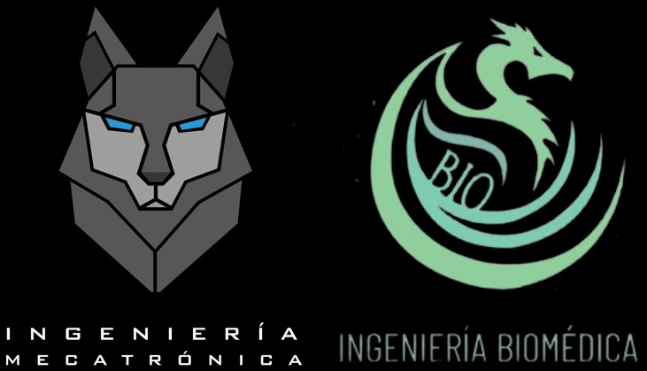
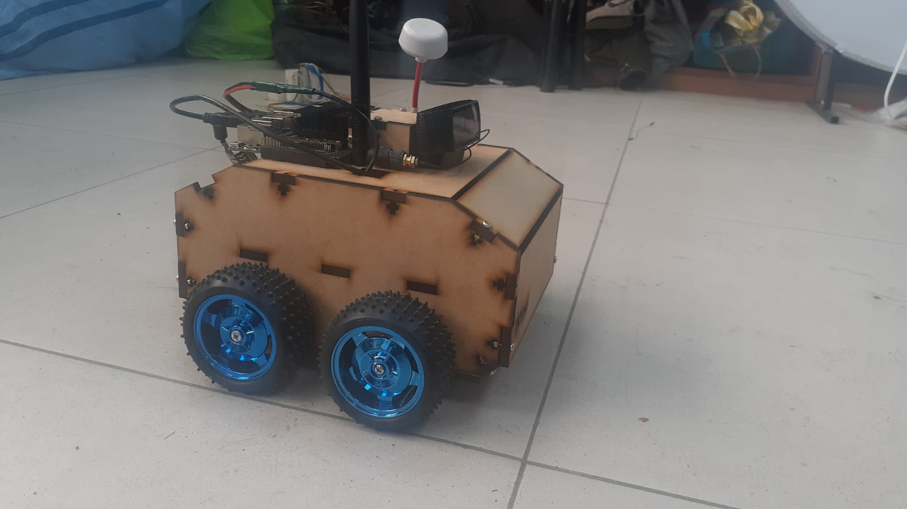
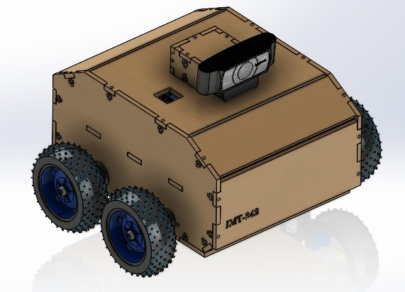
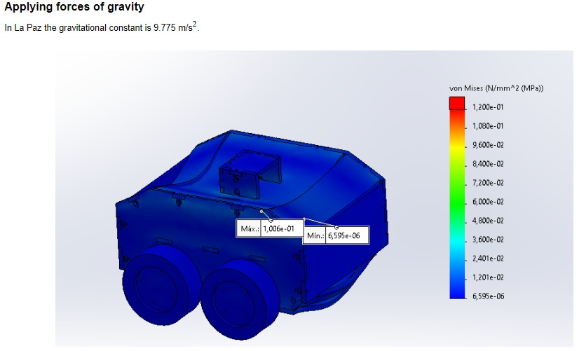

  

# teflon_imt322

## Aplications

This package was created with the intention of providing Teflon robot with the ability to perform 3 applications that combine movement and artificial vision. For this purpose two topics were created: cmd_vel is responsible for Teflon to generate movement using the incorporated motors, usb_cam is responsible for Teflon to use the incorporated camera. Additionally, for machine vision applications, cvBridge is used which acts as a connection to convert between images in ROS format and images in opencv format. This conversion is necessary because image manipulation is facilitated when using the opencv library for this purpose.

The "launch" folder contains the file "usbcam_node.launch", which contains the usb_cam node and configures the image capture parameters such as resolution, pixel format and others. The "src" folder contains the Python codes that allow to combine motion and machine vision. The first file "cam_test_1.py" allows to visualize the camera capture in real time.

The file "cam_test_2.py" is based on mobilenet https://github.com/penseeartificielle/mobilenet-ssd-detection-example, which has the ability to distinguish between multiple objects. However, in this case, for greater accuracy, these objects are restricted to those in the following list: "['bird','bycycle','stop sign','giraffe','clock','person','laptop','tv']". The code is designed so that, once the object is detected, Teflon will try to keep it at a constant distance in front of itself. That is, if the object is at a long distance, Teflon will move forward to get closer; on the contrary, if it is at a short distance, Teflon will move backward to get farther away. In other words, Teflon will follow the object and maintain a constant distance towards it, as long as this object is within its range of vision and can be sufficiently clear to be identified.

In the "cam_test_3.py" file application Teflon is given movement instructions based on the colors it detects. If it detects the color red Teflon stops, if it detects the color green Teflon moves forward, and if it detects the color yellow Teflon moves backward. For color detection the image was converted to HSV format, because in this format variants such as brightness are less influential. A binary mask was created for each color and morphological operations were applied to reduce the mask noise. Teflon performs the instruction corresponding to the color whose percentage of presence is higher.

In the application of the file "cam_test_4.py" Teflon again performs movement, but in this case the instructions are given by text: "AVANZAR", "RETROCEDER" and "PARAR". For image to text conversion we use the "pytesseract" library which uses the OCR system for optimal recognition of alphanumeric characters.

## Dependencies

Before cloning to run the code download the package rossserial from the following repository : https://github.com/ros-drivers/rosserial.git

## Evidence

  

   

   

